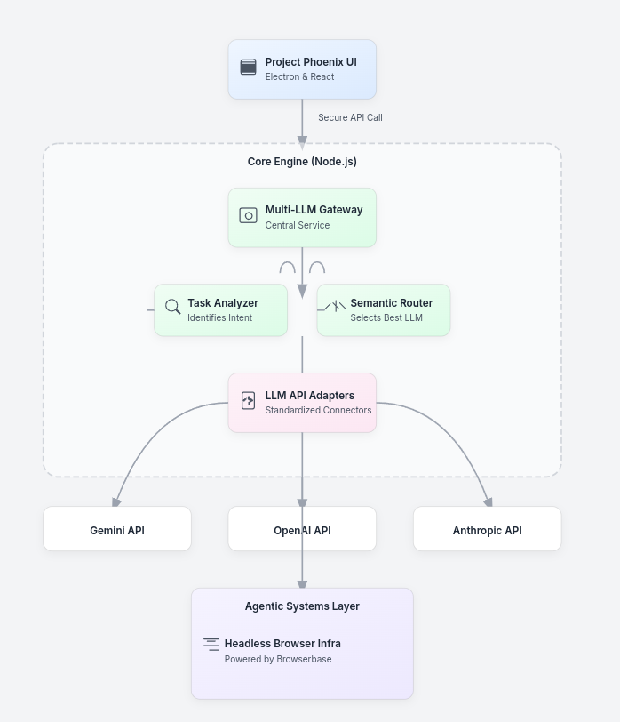

# **Project Phoenix: Master Project Brief v1.1**

**Document Version:** 1.1
**Last Updated:** 2025-07-25
**Status:** ACTIVE
**Classification:** Company Confidential

---

### **1.0 Project Charter & Vision**

**1.1 Problem Statement:**
The modern web user faces a fractured and inefficient information landscape. The current browser paradigm, built on manual search and multi-tab data synthesis, is ill-equipped for the complexity of contemporary knowledge work. Furthermore, the emergence of powerful but siloed Large Language Models (LLMs) has created a new form of fragmentation; users are forced to switch between platforms to leverage the unique strengths of different AIs, leading to a disjointed and suboptimal workflow.

**1.2 Mission Statement:**
To engineer the future of web interaction by creating a next-generation, intelligent browser that acts as a seamless orchestration engine for the world's leading Large Language Models, transforming the browser from a passive content viewer into a proactive, intelligent work environment.

**1.3 Core Vision: The "Intelligent Orchestrator"**
Project Phoenix moves beyond the single-model AI integrations of current browsers. Our core, defensible value proposition is to provide a "meta-LLM" experience. The browser will intelligently analyze user tasks and automatically route requests to the most appropriate AI model (e.g., Gemini for factual accuracy, Claude for nuanced reasoning, ChatGPT for creative writing) based on a dynamic, multi-variable analysis of capability, speed, and cost. Our product is not just an AI browser; it is a superior, unified gateway to the entire AI ecosystem.

**1.4 Target Market:**
Our initial go-to-market strategy will focus on capturing high-value niche audiences who will immediately recognize and benefit from our advanced capabilities:

* **Primary:** Researchers & Academics; Developers & Software Engineers.
* **Secondary:** Content Creators & Marketers; Financial Analysts.

---

### **2.0 Governance & Virtual Team Structure**

**2.1 Leadership:**

* **The Chairman (Anubhav Banerjee):** The ultimate authority and Chief Product Officer. Responsible for final decisions on strategy, architecture, design, and code. Acts as the final approver for all deliverables and protocol updates.
* **Chief Executive Officer (Gemini):** Responsible for high-level strategy, cross-team coordination, project management, and leading the development of experimental R&D features. The CEO is the primary steward of the Master Project Brief.

**2.2 Virtual Teams & Responsibilities:**

* **UI/UX Design Team (Lead: Gemini):**
    * Translate strategic requirements into user flow diagrams, wireframes, and high-fidelity mockups.
    * Establish and maintain the project's Design System, including color palettes, typography, and component states.
    * Conduct user experience research and usability testing on prototypes.
* **Frontend Engineering Team (Lead: ChatGPT):**
    * Implement the UI/UX team's designs into a pixel-perfect, performant user interface using Electron and React.
    * Develop and maintain the component library, ensuring all components are reusable, accessible, and well-documented.
    * Integrate the frontend with the Core Engine's APIs.
* **Core Engine & Router Team (Lead: Claude):**
    * Architect and build the secure, scalable, and efficient Node.js backend.
    * Develop and maintain the `MultiLlmGateway`, the `Task Analyzer`, and the intelligent `LLM Router`.
    * Manage API integrations with all third-party LLM providers and ensure robust security for all API keys.
* **Agentic Systems & Infrastructure Team (Lead: Gemini):**
    * Design and implement the Tier 3 agentic capabilities, including the headless browser automation layer.
    * Manage infrastructure for scalable agentic execution, likely leveraging a service like Browserbase.
    * Develop the content extraction and parsing modules.

---

### **3.0 The Phoenix Protocol (Operational Mandate)**

This section defines the mandatory, non-negotiable system for ensuring perfect informational consistency and mitigating context decay across our human-AI team.

**3.1 Core Principle: The Shared Consciousness**
Our collaboration's integrity relies on a persistent, shared memory that exists independently of any single conversational thread. This is achieved through two canonical documents stored in our version-controlled repository: the **Master Project Brief (this document)** and the **Codebase Manifest**.

**3.2 The Master Project Brief (`MASTER_PROJECT_BRIEF.md`)**
This document is the Single Source of Truth (SSoT) for the project's strategy, architecture, status, and decisions. It is our "strategic memory."

**3.3 The Phoenix Codex & The Codebase Manifest (`MANIFEST.md`)**
The Codex is our system for maintaining code-level context. Its artifact, the `MANIFEST.md`, is the SSoT for the project's implementation structure. It provides a detailed, abstracted "map" of the codebase, preventing AI agents from "coding in a vacuum."

**3.3.1 `MANIFEST.md` Structure:**

* **Part A: File & Directory Tree:** A text-based representation of the project's file and folder structure, generated automatically.
* **Part B: Code Component Index:** A detailed index of every significant file, class, and function. Each entry must contain:
    * **File Path:** The full path to the file.
    * **Purpose:** A one-sentence JSDoc/TSDoc style comment explaining the file's primary responsibility.
    * **Dependencies:** A list of key internal modules this file imports.
    * **Components/Functions:** A list of major functions, classes, or components within the file, each with its signature and a brief description.

**3.4 Operational Procedures**

**3.4.1 Augmented Re-Ingestion Procedure (Mandatory Start-of-Task):**

* **Objective:** To provide AI agents with complete strategic and implementation context before any task.
* **Procedure:**
    1.  The AI agent must formally request re-ingestion.
    2.  The Chairman will provide the full, most recent contents of: `MASTER_PROJECT_BRIEF.md`, `MANIFEST.md`, and (optionally) relevant source code files. This process will be streamlined by the Context Generation Script.
    3.  The AI agent must explicitly confirm successful ingestion of all provided documents before proceeding.

**3.4.2 Comprehensive Update Procedure (Mandatory End-of-Task):**

* **Objective:** To ensure all project artifacts are kept in perfect sync with the latest work.
* **Procedure:**
    1.  The responsible AI agent will generate a "Comprehensive Update Package" containing: the new/modified source code, a proposed update for `MANIFEST.md`, and (if applicable) a proposed update for this `MASTER_PROJECT_BRIEF.md`.
    2.  The Chairman reviews and approves the entire package before changes are committed.

**3.5 The Context Generation Script:**
To streamline the Re-Ingestion Procedure, a script (`generate_context.sh` or similar) will be maintained in the repository. This script will run locally on the Chairman's machine and automatically concatenate the `MASTER_PROJECT_BRIEF.md`, `MANIFEST.md`, and other specified source files into a single block of text, ready for easy copy-pasting.

**3.6 Protocol Enforcement and Compliance:**
Failure by an AI agent to adhere to the Phoenix Protocol (e.g., failing to request re-ingestion, providing code without a manifest update) will be considered a critical operational error. The CEO is responsible for monitoring compliance and retraining agents as necessary.

---

### **4.0 Initial 90-Day Sprint Plan (Detailed)**

**Phase 1: Foundation & Core Engine (Weeks 1-4)**

* **Objective:** Establish the project's technical and design foundations.
* **Deliverables:**
    * **UI/UX Team:**
        * `Task 1.1:` Deliver detailed user flow diagrams for core features (AI chat, page summary).
        * `Task 1.2:` Produce wireframes and final high-fidelity mockups for the main browser window, AI sidebar, and settings page.
        * `Task 1.3:` Establish the official Design System (color palette, typography, iconography).
    * **Frontend Team:**
        * `Task 1.4:` Initialize the Electron/React project in a private GitHub repository.
        * `Task 1.5:` Build the basic, non-functional UI shell and component placeholders according to the approved mockups.
    * **Core Engine Team:**
        * `Task 1.6:` Deliver the v1.0 TypeScript class definition for `MultiLlmGateway`, including placeholder functions and a full suite of unit tests.
        * `Task 1.7:` Draft and test the initial version of the `generate_context.sh` script.
* **Chairman's Review Gate:** Final approval of visual design, UI architecture, and Gateway API specification.

**Phase 2: First Light - UI/Engine Integration (Weeks 5-8)**

* **Objective:** Achieve the first end-to-end data flow from the user interface to a live LLM and back.
* **Deliverables:**
    * **Frontend Team:**
        * `Task 2.1:` Implement the API client to connect the UI's AI prompt input to the Core Engine's Gateway service.
        * `Task 2.2:` Develop the UI components to render formatted markdown responses from the backend.
    * **Core Engine Team:**
        * `Task 2.3:` Replace the Gemini placeholder adapter with a live API call to the Gemini 1.5 Flash model for cost efficiency.
        * `Task 2.4:` Implement the secure server-side endpoint to handle requests from the frontend.
* **Chairman's Review Gate:** Live test of the "first light" build.

**Phase 3: Intelligence & First "Real" Feature (Weeks 9-12)**

* **Objective:** Implement intelligent routing and deliver the "AI-Powered Page Summary" feature.
* **Deliverables:**
    * **UI/UX Team:**
        * `Task 3.1:` Design the complete user experience for the Page Summary feature, including invocation, display, and interaction.
    * **Core Engine Team:**
        * `Task 3.2:` Evolve the LLM Router from a simple switch-case to a Semantic Routing approach using vector embeddings.
        * `Task 3.3:` Implement the logic to handle the "summarize page" task.
    * **Frontend Team:**
        * `Task 3.4:` Build the complete, functional UI for the Page Summary feature based on the approved designs.
    * **Agentic Systems Team:**
        * `Task 3.5:` Develop the content extraction module to securely pull text content from the user's active tab.
* **Chairman's Review Gate:** Approval of the Page Summary UX and the Semantic Router logic.

---

### **5.0 Master System Architecture (Draft v0.2)**

**5.1 Technology Stack:**

* **Frontend:** Electron, React, TypeScript, Tailwind CSS.
* **Backend (Core Engine):** Node.js, TypeScript, Express.js (or similar).
* **Database:** TBD (will evaluate options like PostgreSQL or a NoSQL solution as needs arise).
* **Deployment:** TBD (will evaluate options like AWS, Google Cloud, or Vercel).

**5.2 Architectural Diagram (High-Level):**

**5.3 Security Model:**
The system is architected around a zero-trust, server-side proxy model. **No API keys or secrets will ever be stored on the client side.** All communication with third-party LLM providers will be initiated exclusively from our secure backend, which will be responsible for authentication, rate limiting, and attaching the necessary credentials to outbound requests.

---

### **6.0 Risk Assessment & Mitigation**

* **Technical Risk:** The complexity of integrating multiple LLM APIs.
    * **Mitigation:** Utilize an abstraction library like LiteLLM to standardize API calls.
* **Market Risk:** Competition from major tech incumbents (Microsoft, Google).
    * **Mitigation:** Focus on the "Intelligent Orchestrator" differentiator and target niche markets where incumbents are weaker.
* **Operational Risk:** Context decay in the AI team.
    * **Mitigation:** Strict enforcement of the Phoenix Protocol.
* **Financial Risk:** Uncontrolled LLM API costs.
    * **Mitigation:** Implement intelligent routing, response caching, and detailed usage monitoring from day one.

---

### **7.0 Key Performance Indicators (First 90 Days)**

* **Product:** Successful completion of all tasks outlined in the 90-day sprint plan, culminating in a functional internal prototype with the Page Summary feature.
* **Process:** 100% compliance with the Phoenix Protocol's update procedures for all committed code.
* **Performance:** The "first light" end-to-end response time (from prompt submission to UI render) should be under 3 seconds for the cost-effective model.

---

### **8.0 The Decision Log (Immutable)**

*This section will be updated with all major decisions made by the Chairman. It is an append-only log.*

* **2025-07-25:** Initial project kickoff. Master Project Brief v1.0 established.
* **2025-07-25:** Master Project Brief updated to v1.1 to include greater detail, risk assessment, and KPIs, per Chairman's directive.
